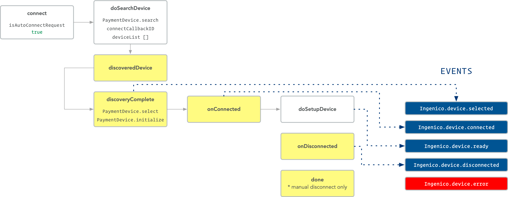
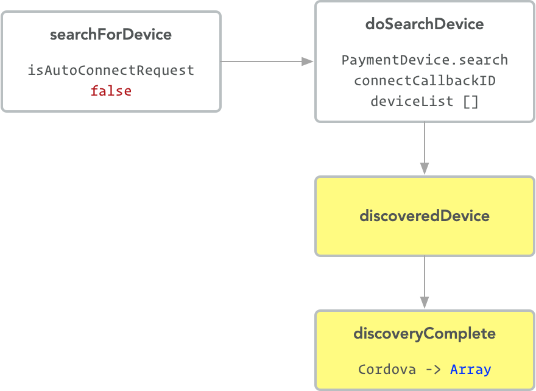
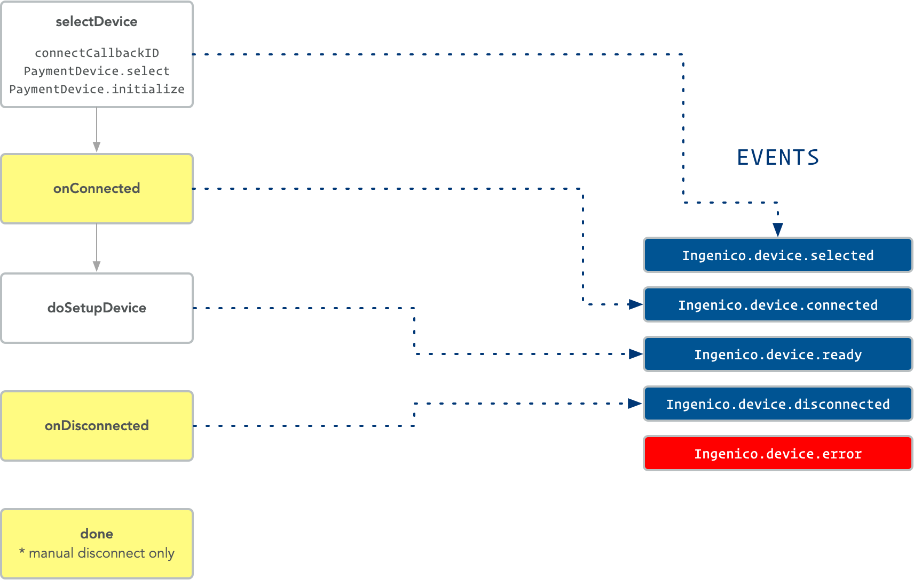

# Ingenico Cordova + Ionic Native Plugin 1.2.0
This plugin allows direct interactions with the native Ingenico mPOS SDK through JavaScript functions in your Ionic app. This includes creating EMV, Swipe and Cash charges, among other features.

## Ingenico mPOS SDK 1.9.0.8 not included
Before installing this plugin into a Cordova or Ionic Project you must download Ingenico's mPOS SDK version 1.9.0.8 and save the ``IngenicoMposSdk.framework`` into the ``./src/ios/frameworks/`` folder. This file is too large to include in the repo and access is required by Ingenico.

## Installation
All the necessary providers for Ionic are included with this plugin. The Ionic Native Plugin and all required Model files are installed to ``/src/providers/ingenico`` within your project so they can be easily
referenced within your application.

## Installing in Ionic Project
It is recommended that you have a ``plugins_src`` folder in the Ionic Project you are installing to and
copy the contents of this repo into the following directory ``plugins_src/cordova-plugin-ingenico``. Once all
files are copied run the following command to install in your project.

```
ionic cordova plugin add ./plugins_src/cordova-plugin-ingenico
```

### Add Native Plugin to src/app/app.module.ts

```javascript
// import
import { Ingenico } from '../providers/ingenico';
// add to @NgModule providers
providers: [
    Ingenico
]
```

### Import Plugin and Models in your Pages as follows

```javascript
// import in ts file ( based on classes needed - Ingenico is always required )
import { Ingenico } from '../../providers/ingenico';
import {
    Amount,
    CashSaleTransactionRequest,
    CreditSaleTransactionRequest,
    DebitSaleTransactionRequest,
    Device,
    DeviceType,
    Product
} from '../../providers/ingenico/models';

// add to constructor
constructor(
    public ingenico: Ingenico
){}
```

## Models
Models used within the plugin have been created as Classes and are installed under ``/src/providers/ingenico/models``. They have been created to match the Ingenico mPOS SDK definitions that are used within this plugin.

## Methods
All methods return a ``Promise``

### Authentication Methods

#### initialize()
_Initialize Ingenico SDK with your API Key, API Base URL and Client Version._

```javascript
// Cordova
Ingenico.initialize(apiKey, baseUrl, clientVersion, success, error);

// Ionic
this.ingenico.initialize(apiKey, baseUrl, clientVersion)
    .then(result => {})
    .catch(error => {});
```

#### login()
_Login to validate authenticity for API access with username and password._

```javascript
// Cordova
Ingenico.login(username, password, success, error);

// Ionic
this.ingenico.login(username, password)
    .then(result => {})
    .catch(error => {});
```

#### logoff()
_Logoff API Session._

```javascript
// Cordova
Ingenico.logoff(success, error);

// Ionic
this.ingenico.logoff()
    .then(result => {})
    .catch(error => {});
```

#### refreshUserSession()
_Refresh an active API Session._

```javascript
// Cordova
Ingenico.refreshUserSession(success, error);

// Ionic
this.ingenico.refreshUserSession()
    .then(result => {})
    .catch(error => {});
```

#### isInitialized()
_Returns if SDK has been initialized_

```javascript
// Cordova
Ingenico.isInitialized(success, error);

// Ionic
this.ingenico.isInitialized()
    .then(result => {})
    .catch(error => {});
```

#### isLoggedIn()
_Returns if User has an active API Session_

```javascript
// Cordova
Ingenico.isLoggedIn(success, error);

// Ionic
this.ingenico.isLoggedIn()
    .then(result => {})
    .catch(error => {});
```

### Device Information Methods

#### getBatteryLevel()
_Get the battery level for an active Device_

```javascript
// Cordova
Ingenico.getBatteryLevel(success, error);

// Ionic
this.ingenico.getBatteryLevel()
    .then(result => {})
    .catch(error => {});
```

#### getDeviceType()
_Return the Device Type set for the SDK_

```javascript
// Cordova
Ingenico.getDeviceType(success, error);

// Ionic
this.ingenico.getDeviceType()
    .then(result => {})
    .catch(error => {});
```

#### getDeviceSerialNumber()
_Get the bserial number for an active Device_

```javascript
// Cordova
Ingenico.getDeviceSerialNumber(success, error);

// Ionic
this.ingenico.getDeviceSerialNumber()
    .then(result => {})
    .catch(error => {});
```

### Device Connection and Setup Methods

#### connect()
_Searches for an available device and automatically selects and initializes the first  device found. This method receives statuses during the entire connection process which can be tracked by listening for dispatched events. This is discussed in [Connection Event Listeners](#connection-event-listeners)._

```javascript
// Cordova
Ingenico.connect(success, error);

// Ionic
this.ingenico.connect()
    .then(result => {})
    .catch(error => {});
```

#### disconnect()
_Disconnects an active Device. Please note this function does a release which invalidates any active session. If this is executed you must log back in to API to be able to connect to a new device and process transactions._

```javascript
// Cordova
Ingenico.disconnect(success, error);

// Ionic
this.ingenico.disconnect()
    .then(result => {})
    .catch(error => {});
```

#### isDeviceConnected()
_Checks if a Device is connected_

```javascript
// Cordova
Ingenico.isDeviceConnected(success, error);

// Ionic
this.ingenico.isDeviceConnected()
    .then(result => {})
    .catch(error => {});
```

#### selectDevice(Device)
_Selects and initializes a Device from available Devices returned from a manual search.This method receives statuses during the entire connection process which can be tracked by listening for dispatched events. This is discussed in [Connection Event Listeners](#connection-event-listeners)._

```javascript
// Cordova
Ingenico.selectDevice(Device,success, error);

// Ionic
this.ingenico.selectDevice(Device)
    .then(result => {})
    .catch(error => {});
```

#### setDeviceType(DeviceType)
_Set the Device Type for the app to use. The application sets the device to `RUADeviceTypeRP750x` and this method allows you to overwrite it to any of the [Supported Devices](#supported-devices)._

```javascript
// Cordova
Ingenico.setDeviceType(success, error);

// Ionic
this.ingenico.setDeviceType(DeviceType)
    .then(result => {})
    .catch(error => {});
```

#### setupDevice()
_Finalizes setup of a selected and intialized device from either ``connect()``_or ``selectDevice()``. Please note this also requires that you are logged in to the API._

```javascript
// Cordova
Ingenico.setupDevice(success, error);

// Ionic
this.ingenico.setupDevice(DeviceType)
    .then(result => {})
    .catch(error => {});
```

#### configureIdleShutdownTimeout(timeoutInSeconds)
_Configure the duration that the device remains active before shutting down. Timeout is assigned in seconds within the range of 180 - 1800._

```javascript
// Cordova
Ingenico.configureIdleShutdownTimeout(timeoutInSeconds,success, error);

// Ionic
this.ingenico.configureIdleShutdownTimeout(timeoutInSeconds)
    .then(result => {})
    .catch(error => {});
```

### Device Search Methods

#### searchForDevice()
_Search for Devices for manual setup. Returns an Array of Devices found._

```javascript
// Cordova
Ingenico.searchForDevice(Device,success, error);

// Ionic
this.ingenico.searchForDevice()
    .then(result => {})
    .catch(error => {});
```

#### stopSearchForDevice()
_Stops searching for Devices intiated by `searchForDevice()` or `connect()`_

```javascript
// Cordova
Ingenico.stopSearchForDevice(success, error);

// Ionic
this.ingenico.stopSearchForDevice()
    .then(result => {})
    .catch(error => {});
```

### Transactions Methods

#### processCashTransaction(CashSaleTransactionRequest)
_Processes a cash transaction._

```javascript
// Cordova
Ingenico.processCashTransaction(CashSaleTransactionRequest,success, error);

// Ionic
this.ingenico.processCashTransaction(CashSaleTransactionRequest)
    .then(result => {})
    .catch(error => {});
```

#### processCreditSaleTransactionWithCardReader(CreditSaleTransactionRequest)
_Processes a Credit Card transaction._

```javascript
// Cordova
Ingenico.processCreditSaleTransactionWithCardReader(CreditSaleTransactionRequest,success, error);

// Ionic
this.ingenico.processCreditSaleTransactionWithCardReader(CreditSaleTransactionRequest)
    .then(result => {})
    .catch(error => {});
```

#### processDebitSaleTransactionWithCardReader(DebitSaleTransactionRequest)
_Processes a Debit Card transaction._

```javascript
// Cordova
Ingenico.processDebitSaleTransactionWithCardReader(DebitSaleTransactionRequest,success, error);

// Ionic
this.ingenico.processDebitSaleTransactionWithCardReader(DebitSaleTransactionRequest)
    .then(result => {})
    .catch(error => {});
```

<a name="connection-event-listeners"></a>
## Connection Event Listeners
During the auto connect or select device process you can listen for custom dispatched events in order to know the state of the Device connection and take action. The dispatched events are as follows:

* __Ingenico.device.selected__<br />
This event is dispatched when a device is selected. At this point the SDK starts the connection process.
* __Ingenico.device.connected__<br />
This event is dispatched when a device is succesfully connected.
* __Ingenico.device.disconnected__<br />
This event is dispatched when a device is disconnected manually or automatically due to the device going to sleep or loosing power.
* __Ingenico.device.error__<br />
This event is dispatched when an error occurs during the device connection process. When this event is received the error code or message is included in the detail object of the event.

Make sure to register listeners and unregister for these listeners properly. Below are examples of how to do this in Ionic.

```javascript

// for undefined properties ( used in listener creation in ionViewWillEnter )
[x: string]: any;

/*
* Bind the functions to respond to your listeners events so you
* can properly remove on ionViewWillLeave()
*/
ionViewWillEnter(){
    // add custom event listeners
    if (!this.onDeviceSelectedBound)
        this.onDeviceSelectedBound = this.onDeviceSelected.bind(this);
    if (!this.onDeviceConnectedBound)
        this.onDeviceConnectedBound = this.onDeviceConnected.bind(this);
    if (!this.onDeviceDisconnectedBound)
        this.onDeviceDisconnectedBound = this.onDeviceDisconnected.bind(this);
    if (!this.onDeviceErrorBound)
        this.onDeviceErrorBound = this.onDeviceError.bind(this);
    document.addEventListener('Ingenico:device:selected',this.onDeviceSelectedBound,false);
    document.addEventListener('Ingenico:device:connected',this.onDeviceConnectedBound,false);
    document.addEventListener('Ingenico:device:disconnected',this.onDeviceDisconnectedBound,false);
    document.addEventListener('Ingenico:device:error',this.onDeviceErrorBound,false);
}

ionViewWillLeave(){
     // remove custom event listeners
    document.removeEventListener('Ingenico:device:selected',this.onDeviceSelectedBound,false);
    document.removeEventListener('Ingenico:device:connected',this.onDeviceConnectedBound,false);
    document.removeEventListener('Ingenico:device:disconnected',this.onDeviceDisconnectedBound,false);
    document.removeEventListener('Ingenico:device:error',this.onDeviceErrorBound,false);
}
```
## Auto Connection Flow


## Manual Connection Step 1 Flow


## Manual Connection Step 2 Flow

